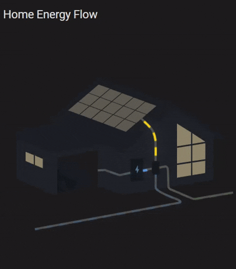
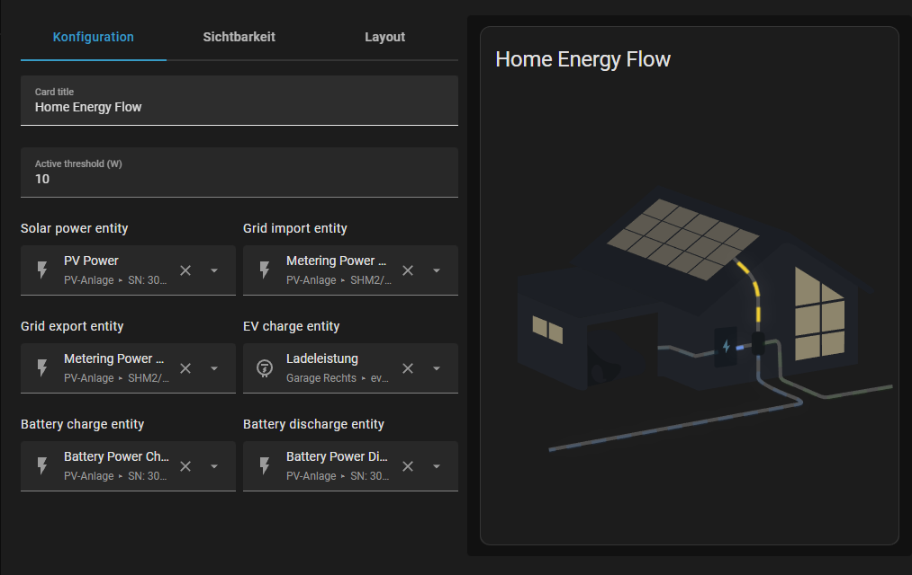

# Power Flow Card for Home Assistant



A custom Lovelace card for visualizing real-time energy flow between grid, solar, battery, and home.  

---

## Features

- Animated flow lines with gradient shine and dynamic speed  
- Top labels with live values for Grid, Solar Panel, and Export  
- Supports grid import/export, solar generation, battery charge/discharge  
- Optional EV and battery entities  
- Optional daily grid import value (uses `last_period`)  
---

## Installation

### **HACS (recommended)**

1. Open **HACS → Frontend**
2. Add a custom repository: `https://github.com/Kokhungchan/power-flow`
3. Install and add the resource:
   - URL: `/hacsfiles/power-flow/power-flow-card.js`
   - Type: **JavaScript Module**

### **Manual**

1. Copy `power-flow-card.js` into `/config/www/`
2. Add the resource:
   - URL: `/local/power-flow-card.js`
   - Type: **JavaScript Module**

## Configuration 

Usage example in YAML:

```yaml
type: custom:power-flow-card
name: Home Energy Flow
threshold: 10
entities:

  solar_power: sensor.sn_3015027172_pv_power
  grid_import_power: sensor.sunny_home_manager_2_metering_power_absorbed
  grid_export_power: sensor.sunny_home_manager_2_metering_power_supplied
  grid_import_daily: sensor.grid_import_daily

  # Optional
  ev_charge_power: sensor.evcc_garage_charge_power
  battery_charge_power: sensor.sn_3017444296_battery_power_charge_total
  battery_discharge_power: sensor.sn_3017444296_battery_power_discharge_total
```

Configuration editor screenshot:



## Credits

Based on and inspired by the original work: https://github.com/LordGuenni/power-flow-card

The Illustrator Base for the SVGs was provided by [ForsakenConversation](https://www.reddit.com/user/ForsakenConversation/)
